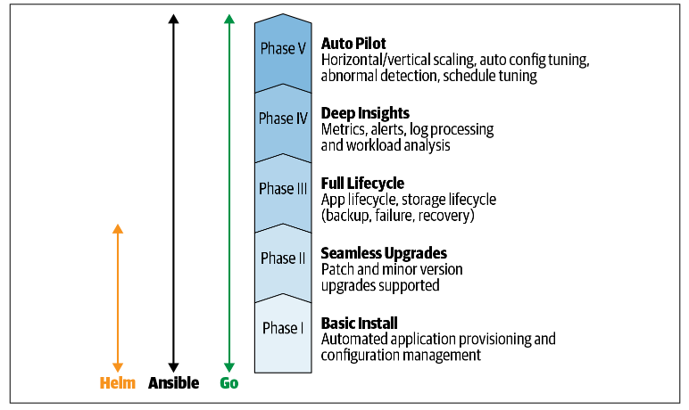

# Tổng quan về Operator Framework

## 1. Nguồn gốc của Operator Framework
- Framework này được xây dựng dựa trên `controller-runtime` của Kubernetes (một tập hợp các thư viện cung cấp các quy trình controller thiết yếu bằng ngôn ngữ Go).
- Nó cung cấp các điểm tích hợp để phân phối, quản lý bằng **Operator Lifecycle Manager (OLM)** và đo lường bằng **Operator Metering**.
- Đây là một dự án mã nguồn mở và đang trong quá trình được đóng góp cho tổ chức Cloud Native Computing Foundation (CNCF) – nơi quản lý chính Kubernetes.

## 2. Mô hình trưởng thành của Operator
- Mô hình này phác thảo các cấp độ chức năng khác nhau của một Operator, giúp các nhóm phát triển đi từ một sản phẩm khả thi tối thiểu (chỉ cài đặt ứng dụng) tiến dần đến tự động hóa hoàn toàn.
- Các giai đoạn phát triển bắt đầu từ **Cài đặt cơ bản** (Basic Install) - nơi chỉ yêu cầu mã hóa vừa đủ để tự động khởi tạo ứng dụng.
- Theo thời gian, Operator được nâng cấp qua các giai đoạn tiếp theo để hỗ trợ quản lý vòng đời ứng dụng, nâng cấp liền mạch, phân tích chuyên sâu và cuối cùng là chế độ **Auto Pilot** (Tự động hóa hoàn toàn các thao tác mở rộng, cấu hình, phát hiện lỗi).

## 3. Công cụ phát triển Operator SDK
- **Chức năng:** Là một bộ công cụ dùng để tạo khung dự án (scaffolding), xây dựng và chuẩn bị triển khai Operator.
- **Công nghệ hỗ trợ:** SDK hiện hỗ trợ hạng nhất cho việc lập trình Operator bằng ngôn ngữ **Go**, đồng thời cung cấp kiến trúc bộ chuyển đổi (adapter) giúp chạy các **Helm charts** hoặc **Ansible playbooks** dưới dạng Operator.
- **Công cụ dòng lệnh `operator-sdk`:** Công cụ này áp đặt một bố cục dự án tiêu chuẩn, tự động tạo ra các mã nguồn Go cơ sở cho controller cũng như tạo sẵn các tệp cấu hình YAML (manifests) để triển khai trên Kubernetes. Nó có thể được cài đặt dễ dàng thông qua tệp nhị phân (binary) hoặc biên dịch từ mã nguồn.

## 4. Trình quản lý vòng đời Operator Lifecycle Manager (OLM)
- Bản thân OLM cũng là một Operator, nhưng nhiệm vụ của nó ở cấp độ cao hơn: thu thập, cài đặt, nâng cấp và quản lý các Operator khác trên cụm Kubernetes.
- OLM sử dụng một lược đồ siêu dữ liệu gọi là **Cluster Service Version (CSV)** để lưu trữ các metadata về Operator cũng như các phần mềm phụ thuộc của nó.
- Thông qua OLM, người dùng có thể subscribe Operator từ một catalog. OLM sau đó sẽ giám sát trạng thái Operator, đảm bảo nó luôn hoạt động, điều phối nếu có nhiều phiên bản trên cụm, và tự động nâng cấp phiên bản cho Operator đó.

## 5. Hệ thống đo lường Operator Metering
- Đây là hệ thống chuyên phân tích mức độ sử dụng tài nguyên (như CPU, bộ nhớ) của các Operator đang chạy trên cụm.
- Nền tảng này hỗ trợ báo cáo tùy chỉnh và 3 hoạt động chính:
    - **Lập ngân sách (Budgeting):** Giúp các nhóm hạ tầng nắm được tài nguyên đang được tiêu thụ như thế nào, từ đó cải thiện việc phân bổ và tránh lãng phí.
    - **Lập hóa đơn (Billing):** Theo dõi mức sử dụng dựa trên các mã thanh toán hoặc nhãn (labels), hỗ trợ tính toán chi phí chính xác nếu Operator đó được cung cấp như một dịch vụ trả phí cho khách hàng.
    - **Tổng hợp số liệu (Metrics aggregation):** Cho phép xem xét và phân tích mức tiêu thụ dịch vụ, tài nguyên trên nhiều namespace và nhiều nhóm làm việc khác nhau trên cùng một cụm lớn.